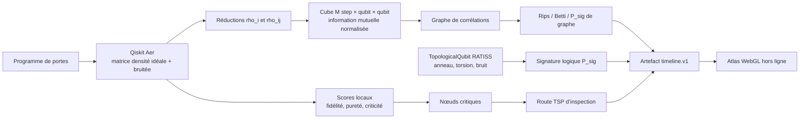

# RATISS Topological Decoherence Engine

**RATISS Topological Decoherence Engine** est le moteur complet de la nouvelle famille de SDK RATISS. Il transforme une trajectoire de circuit simulé en un artefact traçable qui relie une matrice cubique de corrélations, un graphe de corrélations, une analyse topologique, une signature de qubit topologique logique simulé, des scores de criticité et une route d’inspection TSP.

> Ce dépôt prolonge directement le simulateur de qubit topologique trouvé dans la branche RATISS Experimental IA `decoherence-map` au commit `c67d2e7`. Le code source RATISS initial n’est pas modifié. La carte de provenance est disponible dans [`docs/SOURCE_REUSE_MAP.md`](docs/SOURCE_REUSE_MAP.md).

## Ce que le SDK fait aujourd’hui

| Capacité | Implémentation actuelle | Sortie |
|---|---|---|
| Circuit local | Qiskit Aer en mode matrice densité, avec référence idéale et trajectoire bruitée | Une observation par étape de porte |
| Cube | `M[k,i,j] = min(1, I(ρij)/2)` | Tranches `cube_slice` par pas temporel |
| Graphe | Liens issus d’information mutuelle, corrélations de Pauli et concurrence | Nœuds, tubes, degrés et stabilité |
| Topologie du graphe | Rips transparent, Betti et persistance H1 finie | `topology.psig`, diagrammes et Betti |
| Noyau RATISS | Qubit topologique logique simulé en anneau tordu, portes analogues et bruit logiciel | `logical_topology.P_sig`, protection, bit logique |
| Criticité | Composition transparente fidélité / force de graphe / rupture de liens | Nœuds critiques documentés |
| Inspection | TSP exact Hold–Karp ou heuristique déterministe | `tsp_inspection`, explicitement séparé de `P_sig` |
| Portabilité | Artefact JSON versionné | Chargement hors ligne dans `ratiss-decoherence-atlas` |

## Démarrage local

Le moteur est conçu pour une exécution CPU locale. Les dépendances nécessaires sont Qiskit, Qiskit Aer, NumPy et SciPy.

```bash
git clone https://github.com/evinajonathan13-max/ratiss-topological-decoherence-engine
cd ratiss-topological-decoherence-engine
python3 -m venv .venv
source .venv/bin/activate              # Windows PowerShell : .\.venv\Scripts\Activate.ps1
pip install -e .
ratiss-topo-demo --output artifacts/full_timeline.json
```

Sans installation de package, l’exemple peut aussi être lancé depuis une copie de travail :

```bash
PYTHONPATH=src python3 -m ratiss_topological_decoherence.cli --output artifacts/full_timeline.json
PYTHONPATH=src pytest
```

## Architecture



Le `P_sig` de graphe et le `P_sig` du noyau logique sont toujours exportés comme deux valeurs distinctes. Cette distinction évite de présenter un changement dans une couche comme une mesure de l’autre.

## Exemple de résultat du POC fourni

Le scénario livré par défaut est `accelerated_decoherence_stress_demo`. Il est volontairement accéléré pour rendre les ruptures visibles sur onze étapes et donc tester le lecteur d’artefacts ; il ne reproduit pas la durée de porte d’un QPU spécifique.

| Observation du run de référence local | Valeur exportée | Interprétation exacte |
|---|---:|---|
| Étapes | 11 | Initialisation plus dix portes du circuit de démonstration |
| Signature logique initiale | `1.214` | `P_sig` du qubit topologique logique simulé RATISS |
| Signature logique finale | `0.766` | Dégradation dans le modèle de bruit logiciel du noyau logique |
| Topologie de graphe finale | Betti `[1,0,0]`, `P_sig=0.000` | Le graphe issu de cette trajectoire ne contient pas de cycle H1 fini persistant à cette étape |
| Route d’inspection finale | `3 → 4 → 3` | TSP exact sur deux nœuds qui dépassent le seuil de criticité du scénario ; **ce n’est pas `P_sig`** |

## Interfaces principales

```python
from ratiss_topological_decoherence import SimulationConfig, run_local_demo
from ratiss_topological_decoherence.logical_qubit import TopologicalQubit

artifact = run_local_demo(SimulationConfig())
logical_qubit = TopologicalQubit(protection=0.15, seed=42)
signature = logical_qubit.h_gate().noise(0.05).measure_state()
```

Le détail des champs et contrats se trouve dans [`docs/API_REFERENCE.md`](docs/API_REFERENCE.md). Les limites de portée, les seuils et la séparation TSP/persistance sont décrits dans [`docs/ARCHITECTURE_CONTRACT.md`](docs/ARCHITECTURE_CONTRACT.md).

## Réutilisation et extension

Le SDK prépare trois types d’entrée, avec une frontière nette :

| Entrée | Statut | Chemin d’extension |
|---|---|---|
| Circuit simulé | Fonctionnel localement | Personnaliser la liste de `GateSpec` ou fournir un programme compatible |
| Résultats mesurés / QPU | Adaptateur à construire, optionnel | Convertir les comptes Pauli ou matrices d’état vers `timeline.v1`, sans jeton dans le dépôt |
| Bio-cohérence ou autre phénomène fourni | Contrat d’analyse à adapter | Importer une trajectoire de relations/corrélations et déclarer explicitement le modèle de mesure ; pas de diagnostic biomédical |

## Portée et honnêteté

Le dépôt ne fabrique pas de qubit matériel, ne constitue pas un modèle de fabrication, ne déclenche aucune correction matérielle et ne remplace pas une expérience QPU. Son apport actuel est un **SDK local d’analyse topologique et de visualisation** fondé sur un simulateur logique RATISS existant, enrichi d’une matrice densité, d’artefacts versionnés et d’un atlas WebGL indépendant.

## Documents

| Document | Contenu |
|---|---|
| [`ARCHITECTURE_CONTRACT.md`](docs/ARCHITECTURE_CONTRACT.md) | Maths, matrice cubique, topologie, criticité, TSP et profils local/connectable |
| [`SOURCE_REUSE_MAP.md`](docs/SOURCE_REUSE_MAP.md) | Provenance RATISS de chaque brique réutilisée |
| [`API_REFERENCE.md`](docs/API_REFERENCE.md) | API Python, contrat JSON et règles de compatibilité |
| [`PROOF_OF_CONCEPT.md`](docs/PROOF_OF_CONCEPT.md) | Protocole, résultat du run, tests et interprétation |
| [`INTEGRATION_GUIDE.md`](docs/INTEGRATION_GUIDE.md) | Intégration locale, atlas et futur adaptateur externe |
